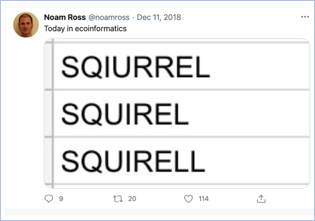

```{r setup, include=FALSE}
library(knitr)
library(rmdformats)

## Global options
options(max.print="75")
opts_chunk$set(echo=FALSE,
	             cache=TRUE,
               prompt=FALSE,
               tidy=TRUE,
               comment=NA,
               message=FALSE,
               warning=FALSE)
opts_knit$set(width=75)
```

# Class Outline: QA/QC 2 - Open Refine

## Objectives and Competencies:   

By the end of this lesson students will:

* Be able to import a data set into OpenRefine, make changes to the data set and its structure, and export the revised data set  

* Learn how to automatically track changes made and export the record of changes

* Be able to apply these changes to a different data set

## Pre-Class Preparation (Instructor):  

  * Remind via email about OpenRefine Installation
  * Post Data sets

**Bring to Class:  **  

  * Snacks
  * Tent cards for student names

## Pre-class Preparation (Students):

### **Online Lectures:**  None

### **Readings**: None


<!-- * **In-class Exercise:**   -->
<!--     * Data Carpentry Lesson (2:15 h) -->
<!--     * https://datacarpentry.org/openrefine-socialsci/ -->
<!--     * https://datacarpentry.org/OpenRefine-ecology-lesson/ -->

### Computer Resources

1. Install OpenRefine on your computer and verify it works by following the [instructions here](https://datacarpentry.org/openrefine-socialsci/setup.html).

2. _Optional:_ Read and watch about [how OpenRefine works here](https://openrefine.org/). You can also review the [basic workflow](https://hackmd.io/WnKT7eiMQde7jCF5teVHBQ#Setup) we will learn.


```{r timer, echo=FALSE}
part_1 <- 10
part_2 <- 10
part_3 <- 45
snack_break <- 10
part_4 <-30
part_5 <-45
part_6 <-10

total_time <- 
  part_1 + 
  part_2 + 
  part_3 + 
  part_4 +
  part_5 +
  part_6 +
  snack_break 

time_remain <- 180 - total_time
```

## In-Class: Using Open Refine to clean data

{width=30%}


OpenRefine is a powerful, free, and open source tool that is used to work with and clean messy data.  We will be working through some of OpenRefine's basic features, after which you will trying them onm your own on a new data set.

<!-- **_Note: _** This is the url for accessing OpenRefine if a new tab/window doesn't open: http://127.0.0.1:3333/ -->

### **Intro to OR** (`r part_1` min)

### **Working with OR**  (`r part_2` min)  

### **Filtering and Sorting** (`r part_3` min)
     
### Break (`r snack_break` min)

### **Examining Numbers** (`r part_4` min)

### **Using Scripts, Exporting, and Saving**  (`r part_5` min)  

### **Wrap-up, Questions**  (`r part_6` min)  

## **Assignment** (`r time_remain` min)

Now it's your turn. [Download this csv file](https://raw.githubusercontent.com/BrunaLab/LAS6292_DataManagement/5005ea1551fc12eb5bcc561beef0bf4d9c3a066e/content/course-materials/class-sessions/06-QAQC2/portal_rodents_or_short.csv) and use OpenRefine to clean it up. After you create a Project, edit the data as follows:

1. Correct and standardize the names of the countries in which the rodents were captured. 

2. The column `scientificName` contains two pieces of information (the Genus _and_ species of each animal). Split this into two columns, rename them as `genus` and `species`, and then correct and standardize the data in each column as needed. NB: You may run into an obstacle when you try to rename the columns. How can you get around it?

3. Save the clean data as a CSV file on your desktop.

<!-- grel:	if(value=="AH","Ammospermophilus harrisi","") -->

4. Extract and save your steps (i.e., 'operation history' as JSON. Save this as a text file. 

5. _Bonus Brainteaser:_ Many of the cells in the column for the Latin bonomial are blank. How might you go about filling them in based on the column with the abbreviation?

6. **Submission:** Submit your clean .csv and the JSON text file as `week6_hw` on Canvas.  

### Grading Rubric: 

Data corrected and JSON file can be used on another data set: 50  
Most data correction properly programmed; some require instructor follow-up: 40  
Many of the corrections missing, JSON file unable to process new data : 30  
Instructor follow-up required to implement most changes: 20  

# Sources for this lesson 

1. Data Carpentry: [Data Cleaning with OpenRefine for Social Scientists	](https://datacarpentry.org/openrefine-socialsci/). 

<!-- Peter Smyth, Geoff LaFlair, Lachlan Deer, Tracy Teal, Karen Word, François Michonneau, & Erin Becker. (2018, May 20). datacarpentry/openrefine-socialsci: OpenRefine Social Sciences Release, May 2018 (v3). Zenodo. https://doi.org/10.5281/zenodo.1250074 -->
<!-- 2. The repository with the data and metadata used in the lesson:  [SAFI_Survey](https://figshare.com/articles/dataset/SAFI_Survey_Results/6262019) -->

2. Data Carpentry: [Data Cleaning with OpenRefine for Ecologists](https://datacarpentry.org/OpenRefine-ecology-lesson/04-scripts/index.html)


# Additional Tools and Resources

## OpenRefine Home

*  [Open Refine](https://openrefine.org/) Homepage. Includes the [user's manual](https://docs.openrefine.org/) and links to [more tutorials](https://openrefine.org/documentation.html).

## UF Library Workshops

* The UF Library teaches a number of excellent workshops, including one on using OpenRefine taught by Dr. Hao Ye. You can see the schedule (or request one) [here](https://ufl.libcal.com/calendar/workshops/?cid=11693&t=d&d=0000-00-00&cal=11693,5125,8858&inc=0).

## Tutorials

*  Environmental Data Initiative [OpenRefine Tutorial](https://environmentaldatainitiative.org/webinars-events/previous-edi-events/how-to-clean-and-format-data-using-r-packages-datamaid-dplyr-openrefine-excel/)
* Cleaning Data with OpenRefine Video Tutorials: 
    * [Video Tutorial No. 1](https://www.youtube.com/watch?v=nORS7STbLyk)
    * [Video Tutorial No. 2](https://www.youtube.com/watch?v=xZlz4ISgNBc)
*  JHU Library: [Cleaning Data with OpenRefine](https://libjohn.github.io/openrefine/index.html)
* The Programming Historian Website: [Cleaning Data with OpenRefine](https://doi.org/10.46430/phen0023).

## GREL Cheatsheets

* Belinda Weaver's [GREL Cheatsheet with examples](https://github.com/weaverbel/teachingfiles/blob/master/grel_value_replace.md) 
* [OpenRefine GREL Manual](https://docs.openrefine.org/manual/expressions/#grel-general-refine-expression-language)
* A really good [GREL Guide](https://guides.library.illinois.edu/openrefine/grel) from the Univ Illinois
* Even better: code4lib Toronoto's [OpenRefine cheatsheets](https://code4libtoronto.github.io/2018-10-12-access/GoogleRefineCheatSheets.pdf), including for GREL commands.
* Datenschule's [OR Cheatsheets](https://datenschule.de/files/downloads/workshops/CheatSheet-Open-Refine.pdf)

## R Tools

*  The [rrefine package](https://cran.r-project.org/web/packages/rrefine/vignettes/rrefine-vignette.html) allows you to do some OpenRefine tasks from within R. 

