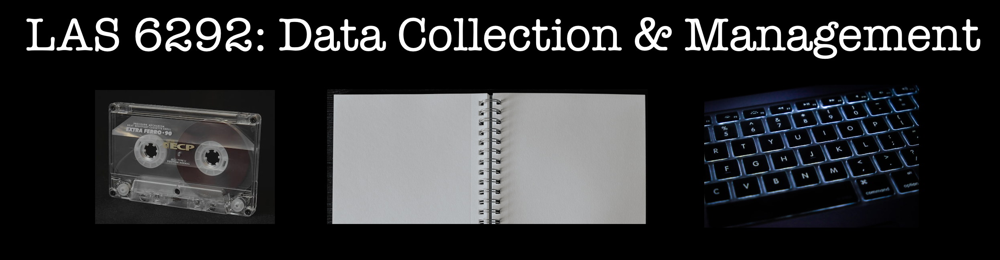

\thispagestyle{empty}

```{r setup_syllabus, include=FALSE}
knitr::opts_chunk$set(echo = TRUE)
library(tidyverse)
library(kableExtra)
library(tidyverse)
library(RColorBrewer)
library(viridis)   
```

```{r banner, echo=FALSE, include=TRUE, out.width = '100%', fig.align="center"}

```


<!-- --- -->
```{r course_info, echo=FALSE,message = FALSE,warning=FALSE}

title<-c("LAS 6292: Data Collection & Management")
year<-c("Spring Semester 2024")

class_time<-c("Fridays 12:50-3:50","Grinter Hall 376")
class_loc<-c("Grinter Hall 376","---")

prof_name<-c("Dr. Emilio M. Bruna")
prof_email<-c("embruna@ufl.edu")
prof_phone<-c("(352) 846-0634")
prof_office<-c("Office: TEC Lab, 711 Newell Dr.")

prof<-c("\\color{darkmidnightblue}Instructor",prof_name, prof_email, prof_phone)
class_time<-c("\\color{darkmidnightblue}Class Sessions",class_time,"")

prof<-as_tibble(prof)
time<-as_tibble(class_time)

course_info<-bind_cols(prof,time) %>% rename("Instructor" ="value...1",
                                                      "Class Sessions" ="value...2")
```

\vspace{0.5cm}  

```{r instructors, echo=FALSE,message = FALSE,warning=FALSE,fig.pos='H'}
# course_info %>% select(-Location) %>% 
course_info %>%
  kbl(booktabs = T,
      bottomrule = F,
      # toprule = F,
      # midrule = F,
      escape= F,
      format="latex",
      align="cc",
      col.names = NULL) %>%
  kable_paper(full_width = F,
              position = "left") %>%
  kable_styling(latex_options = "HOLD_position") %>%
  row_spec(1,bold=T,color = "darkmidnightblue") %>%
  column_spec(1,width = "10em", background="white", latex_valign = "m",color = "black") %>%
  column_spec(2, width = "10em",latex_valign = "m", background = "white", color="black") %>%
  # column_spec(3, width = "11em",latex_valign = "m", background = "white", color="black") %>%
  # column_spec(4, width = "6em",latex_valign = "m", background = "white", color="black") %>%
  sub("\\\\toprule", "", .) %>% # Removes top line
  sub("\\\\bottomrule", "", .) # remove bottom line
``` 

<!-- \vspace{-0.5cm}   -->
\vspace{-0.3cm}

---   

\vspace{-0.5cm}

# COURSE OVERVIEW

\vspace{0.2cm}

<!-- \vspace{-0.5cm} -->

This course is a practical introduction to methods, tools, and best practices for collecting, organizing, managing, and visualizing qualitative and quantitative data. It is designed for graduate students from all disciplines at any stage of their program. *_At the conclusion of the course students will be able to_:*

1.	Describe the different types of research data;
2.	Explain the need for and benefits of data management and sharing;
3.	Describe and implement best practices for the collection, storage, management, archiving, and sharing of research data;
4.	Find, download, and analyze publicly available data from repositories;
5.	Carry out simple and reproducible data corrections and data set organization;
6.	Describe public policies and agency requirements for data management and sharing; 
7.	Articulate the major legal and ethical considerations regarding data collection, use, and storage (e.g., privacy/human subjects, intellectual property, international law);
8.	Create and Implement Data Management Plan in funder-specific formats;
9.	Identify and properly use tools for more efficient and secure data collection in the field.


**Course Format:** This course is taught (mostly) as an active-learning workshop. Students are expected to complete reading or watch some short video lectures prior class. The in-class session will typically include an opportunity to ask questions about the pre-class materials and for me to demonstrate challenging concepts; occasionally there will be a class discussion about the reading. Most of the session, however, will be spent working - sometimes in groups, sometimes individually - on exercises that reinforce the session's concepts and techniques. During class I will be circulating between groups to assist with the assignment, work though mistakes, and discuss how the techniques can be applied to your research. 

<!-- \vspace{-0.3cm} -->


```{r materials, echo=FALSE, include=TRUE,fig.cap="Required Course Materials", out.width = '3%' , fig.align="left"}
# knitr::include_graphics("./icons/pencil.png")
knitr::include_graphics("./icons/hummingbird.png")
```

\vspace{-0.3cm}

**Students are not required to purchase any textbooks or course materials.** All class materials & assignments are on the class website (https://las6292.netlify.app/). Some assigned readings may come from the *New York Times* and have dynamic multimedia data visualizations and video that can't be appreciated in the posted .pdf format. *Students in this class should sign up for free online access to the New York Times* by following the instructions at [this UF Libraries Website](https://businesslibrary.uflib.ufl.edu/c.php?g=943928&p=7708734).

**Materials and Supplies Fees**: None.  

<!-- \newpage -->

```{r office_hours, echo=FALSE, include=TRUE,fig.cap="Instructor Office Hours", out.width = '3%', fig.pos='h', fig.align="left" }
# 

```

\vspace{-0.5cm}

**Time and Signup:** Wednesday & Thursday 10:30-11:45 am (in-person & online). Drop by anytime or sign up for a specific time here: [https://embruna.youcanbook.me](https://embruna.youcanbook.me).If you can't make it these days/times please let us know - we will find a time to meet that works for you.

- ***Location - in-person:*** The Tropical Ecology & Conservation Lab is located next to the Rawlings Hall bus stop (711 Newell Drive; to find a map click the "Contact" link at [BrunaLab.org](http://brunalab.org)).

- ***Location - online:*** use the zoom link on the course Canvas page. I am online the entire session.  

--- 

# COURSE CALENDAR, ASSIGNMENTS, & GRADES
&nbsp;  
```{r outline, echo=FALSE}
Week <- c(seq(1, 15, by = 1), "Finals Week")

Dates <- c(
  "1/12",
  "1/19",
  "1/26",
  "2/2",
  "2/9",
  "2/16",
  "2/23",
  "3/1",
  "3/8",
  "3/15",
  "3/22",
  "3/29",
  "4/5",
  "4/12",
  "4/19",
  "4/30"
)

Topic <- c(
  "‘Data’ across disciplines and the Research Data Life Cycle",
  "File Formats, Naming Conventions, Data Storage & Security",
  "Structure & Format of Data & Datasets",
  "Reproducible Data (Re)organization",
  "QA/AC 1: Data Entry & Validation",
  "QA/QC 2: Correction & Synthesis with Open Refine",
  "QA/QC 3: Visualizing Data (to Find Mistakes)",
  "Documentation: Metadata & Codebooks; Data Sharing, Reuse, & Archives",
  "Data Management Plans",
  "No Class - Spring Break ",
  "Efficient Data Collection",
  "Transcription & Translation",
  "Paperless Data Collection",
  "Automated Data Extraction",
  "Legal & Ethical Issues",
  "Submission of Final Projects by 5 pm"
)

outline <- data.frame(Week, Dates, Topic)

kable(outline,
  align = "ccl",
  format = "latex",
  row.names = FALSE,
  booktabs = T,
  linesep = ""
) %>% # removes the blank line after every 5 lines) %>%
  kable_styling(position = "center",latex_options = "HOLD_position")
```


\vspace{0.3cm}

```{r assignments, echo=FALSE, include=TRUE,fig.cap="Final Course Grades", out.width = '3%', fig.pos='h', fig.align="left" }
# 

```

\vspace{-0.3cm}

**The final course grade is based on the assignments below.**. Most of the in-class assignments involve hands-on practice with data collection or manipulation. In some weeks, however, assignment will be the submission of questions for group discussion or brief reflection on the issues from the readings. Note also that most in-class assignments are designed to be completed during the class session, but to ensure students master the concepts rather than rush through them *they can be submitted anytime before 9 am the day of the following class session.*Late assignments will lose 10 pts. Finally, **_there is no Final Exam in this course_, and the Individual Project is due on the scheduled date of the final exam._** 
 

```{r points, echo=FALSE}
in_class <- 25
no_classes <- 14
in_class_total <- no_classes * in_class
# peer_dmp_review <-50
dmp <- 150
# peer_code_review <-100
project <- 500
course_total <- 
  in_class_total +
  project + 
  dmp 

# dmp_peer_due<-c("16 March 2023")
dmp_due<-c("23 March 2024")
# peer_code_review_due<-c("28 March 2023")
project_due<-c("30 April 2024")

Assignment <- c(
  "Weekly in-class exercises",
  # "DMP Peer Review",
  "Data Management Plan",
  # "Peer Code Review",
  "Individual Data Cleanup Project",
  "TOTAL"
)

Points<- c(
  in_class_total,
  dmp,
  project,
  course_total
  )

Percentage<- c(
  paste("(",(round(in_class_total/course_total*100,1)),"%)",sep=""),
  paste("(",(round(dmp/course_total*100,1)),"%)", sep=""),
  paste("(",(round(project/course_total*100,1)),"%)", sep=""),
  paste("(",(round(course_total/course_total*100,1)),"%)", sep="")
)


Points<-paste(Points,Percentage)

Due<- c(
  "Following Friday at 9 am",
  # "21 March",
  "23 March",
  # "22 March",
  "30 April",
  ""
)

assignments <- data.frame(Assignment, Points,Due)
names(assignments)<-c("Assignment", "Points (%)","Due")

# outline<-bind_cols(Week,Dates,Topic)
kable(assignments,
  align = "lcl",
  format = "latex",
  row.names = FALSE,
  booktabs = T,
  linesep = "") %>% 
  # removes the blank line after every 5 lines) %>%
  kable_styling(position = "center",latex_options = "HOLD_position") %>% 
  row_spec(3,hline_after=T) %>% 
  add_indent(c(4)) %>% 
  row_spec(4, bold=T)

```

**_Regrades:_** Requests for re-evaluation of assignments must be accompanied by an explanation for why you think you deserve additional credit and the number of additional points you think you deserve. The deadline for submission is one week after the work was returned.

```{r grades, echo=FALSE, include=TRUE,fig.cap="Final Course Grades", out.width = '3%', fig.pos='h', fig.align="left" }
# 

```

\vspace{-0.3cm}

Course grades will be based on the percentage of total points earned and will be assigned with the following scale:  **A:** >93%   **A-:** 92-90%   **B+:** 89-87%    **B:** 86-83%   **B-:** 82-80%  **C+:** 79-77%    **C:** 76-73%   **C-:** 72-70%.  **D+:** 69-67%    **D-:** 62-60%    **E:** 59% and below.  

\vspace{0.1cm}

**_Grade Points:_** For information on how UF assigns grade points, visit: 
\newline
<https://catalog.ufl.edu/UGRD/academic-regulations/grades-grading-policies/

--- 

```{r ridges_image, echo=FALSE, include=TRUE, out.width = '90%', fig.align="center" }
knitr::include_graphics("./icons/ridges.png")
```

