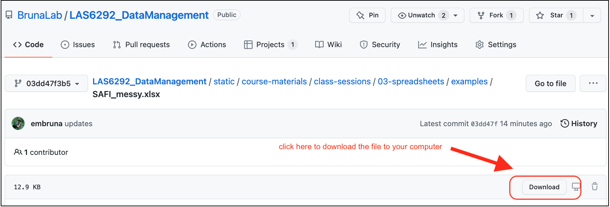

```{r setup, include=FALSE}
library(knitr)
library(rmdformats)

## Global options
options(max.print="75")
opts_chunk$set(echo=FALSE,
	             cache=TRUE,
               prompt=FALSE,
               tidy=TRUE,
               comment=NA,
               message=FALSE,
               warning=FALSE)
opts_knit$set(width=75)
```

# Class Outline: Data Organization in Spreadsheets

## Objectives and Competencies:   

  * Be able to identify different categories of data 
  * Learn best practices for data entry
  * Recognize and avoid common problems with data entry and formatting in spreadsheets
  * Learn and be able to implement 'Tidy' format for data tables in spreadsheets
  * Identify problems with and approaches for proper handling of dates in spreadsheets
  * Learn how to export data from spreadsheets in open format


## Pre-Class Preparation (Instructor):  

**Send in an email to students:  **  

  * Remind everyone about the computer with spreadsheet software prior to class

**Bring to Class:  **  

  * Snacks
  * Flip charts and markers
  * Dry write markers
  * Tent cards for student names


## Pre-class Preparation (Students):

### **Online Lectures:**  None

### **Readings**

1.  Tesi, W. 2020. An Outdated Version of Excel Led the U.K. to Undercount COVID-19 Cases. Slate. 
        [[read online]](https://slate.com/technology/2020/10/u-k-covid-19-spike-caused-by-microsoft-excel-error.html)  
        
2. Stolberg et al. 2020. CDC Test Counting Error Leaves Epidemiologists ‘Really Baffled’. NY Times.  
        [[read online]](https://www.nytimes.com/2020/05/22/us/politics/coronavirus-tests-cdc.html?referringSource=articleShare)  

3.  Broman, K. W., & Woo, K. H. (2018). Data organization in spreadsheets. The American Statistician, 72(1), 2-10.   [[read online]](https://www.tandfonline.com/doi/full/10.1080/00031305.2017.1375989) 

4.  Johnson, B. D., Dunlap, E., & Benoit, E. (2010). Organizing "mountains of words" for data analysis, both qualitative and quantitative. Substance Use & Misuse, 45(5), 648-70.  [[read online]](https://www.tandfonline.com/doi/abs/10.3109/10826081003594757?journalCode=isum20) 

### Computer Resources

1. **Please bring your computer**. If you need to borrow a laptop or get access to a computer let me know.
    
2. You will need a **spreadsheet program** such as MS Excel or LibreOffice installed on your comouter. You can use the program of your choice, but the exercises are optimized for MS Excel. UF students can download the Microsoft Office suite free of charge [here](https://it.ufl.edu/services/gatorcloud-microsoft-office-online); if you don't want to install Excel you can use the online version for free ([see this tutorial video on how to do so](https://youtu.be/ePrGRj9o7sU)). LibreOffice is a free and open source package similar to (and compatible with) MS Office. It can be downloaded [here](https://www.libreoffice.org/).

3. The paper by Broman and Woo on how to organize data in spreadsheets is *especially* important; it may well be one of the more helpful papers you read while a student. Really.

4. It is also time to install two other pieces of software. We won't use them until Week 4, but it is worth installing them now to make sure they are working smoothly:  
    
    (i) **the R programming language**: You can download the version of R for your computer operating system [here](https://cran.rstudio.com/); it's free.
    
      * **_For Mac computers_** click on 'Download R for (Mac) OS X', then chose the version of R for your operating system, i.e., macOS 10.13 (High Sierra), OS X 10.11 (El Capitan), Mac OS X 10.9 (Mavericks), etc.  
      * **_For PC computers_**: click on Download R for Windows, then click 'base' or 'install R for the first time'.  
      * **_For Linux_**: click on 'Download R for Linux'; after which you are on your own. Then again you use Linux, so you probably don't need my help anyway.  
      * **_If you need help:_** watch [this video tutorial](https://www.linkedin.com/learning/learning-r-2/installing-r?u=41282748) or contact me. _Note that the tutorial requires you be a UF affiliate and either on campus or logged to the UF network via VPN_.   
        
    (ii) **RStudio**: the software used to work with R. There are other 'environments' one can use for R programming, but RStudio is by far the most widely used and useful. 

      * We use the 'Free Open-Source Desktop Version', which [you can download here](https://rstudio.com/products/rstudio/download/#download). Choose the version for your computer operating system and install as you would any other software. 
      * **If you need help**: watch [this video tutorial](https://www.linkedin.com/learning/learning-r-2/installing-rstudio?u=41282748) or contact me. _Note that the tutorial requires you be a UF affiliate and either on campus or logged to the UF network via VPN_. 
    
    (iii) **Verify the installations** worked by opening RStudio to see if it opens properly. If you are really motivated, you can also install the `Tidyverse` library by starting RStudio and at the console typing `install.packages("tidyverse")`.


```{r timer, echo=FALSE}
t1_overview <- 15
t2_overview <- 10
breakout1 <- 30
breakout1_return <-40
cleaning_demo <-0
snack_break <- 10
proj_overview <- 0
breakout2 <- 45

total_time <- t1_overview + 
  t2_overview + 
  breakout1 + 
  breakout1_return + 
  cleaning_demo +
  snack_break + 
  proj_overview + 
  breakout2 

time_remain <- 180 - total_time
```


## Session Introduction

### **Types of Data** (`r t1_overview` min)

Down the road when doing data correction, organizing data, and doing analyses it will be essential to classify data according to their 'type'. It can also help with data entry, which is why we will introduce some of these types here:

1. **Nominal aka Factor:** categories or groups, such as [`apple`, `orange`], [`trumpet`, `flute`, `violin`]
2. **Ordinal aka Ordered Factor:** groups where there is an order: [`first`>`second`>`third`], [`small`<`medium`<`large`]. Note that this order doesn't imply quantitative value, e.g., One is not stating that `medium` is twice the size of `small` or that `large` is twice the size of `medium.` 
3. **Character**: [`a`, `gnv`, `mexico`, `Inigo Montoya`]
4. **Numeric (real or decimal):** `2`, `15.5`
5. **Integer:** [`1`,`2`,`3`]
6. **Logical:** [`True`, `False`]
7. **Complex:** `1+4*i`
8. **Interesting case:** what category are [`red`, `orange`, `green`, `blue`]? We usually treat it as Nominal, but it is actually Ordinal - the colors represent wavelengths on the visible light spectrum (650, 600, 550, and 450 nm respectively). If you were recording the wavelength itself, it would be Numeric. 
9. *For more on different categories of data you can [watch this video on LinkedIn Learning](https://www.linkedin.com/learning/introduction-to-data-science-2/statistical-data-types?u=41282748)*. More information on how to log on to LinkedIn Learning as a UF Affiliate is found [here](https://training.it.ufl.edu/linkedin/)

### **Spreadsheets**  (`r t2_overview` min)

Spreadsheets are ok for data entry, but they have some features that make it easy to do terrible, terrible things. People often use spreadsheets for much more, including calculations, statistical analyses, and creating tables or figures for publications and presentations. 

**After you have entered data in a spreadsheet:**

&nbsp;&nbsp;&nbsp;&nbsp;**Don't do calculations or data correction**  
  
&nbsp;&nbsp;&nbsp;&nbsp;**I implore you.**  
    
&nbsp;&nbsp;&nbsp;&nbsp;**Don't. Please**  
  
There are several reasons why.  

**(A)** The 'drag-and-drop', menu-driven nature of spreadsheet programs makes it very difficult (or impossible) to replicate your steps, much less those of another person. This means you can't easily find where mistakes were made, and if you have to reconstruct an analysis or figure you have to start from from the very beginning This is extremely tedious.   

**(B)** Furthermore, when doing calculations in a spreadsheet it is easy to accidentally apply a slightly different formula to multiple adjacent cells. It is easy to introduce mistakes.  

**(C)** Finally, at some point during your data correction or analyses - probably without even realizing it - you will make a mistake either 'sorting' or trying to fill in cells with 'copy-drag-drop-paste'. This will potentially ruin several days of your life (or more) while you try to fix it (assuming you realize you made this mistake, which people often don't).
    

## **Breakout 1: Group Discussion (`r breakout1` min) **

Much of your future as a researcher will be spent cleaning and correcting data, but you can reduce the time spent on this task (and the associated stress) considerably by implementing some good practices from the start. To start developing these good habits we will to take a look at some spreadsheets, identify the things that people should **_not_** be doing with them, and then determining what they should be doing instead.


1. Download the following three spreadsheets. To download the files, click the links and then the `download` button (shown below) on the right-hand side.  

{width=50%}

  * `SAFI_messy.xlsx`: [download link](https://github.com/BrunaLab/LAS6292_DataManagement/blob/03dd47f3b52a9bf32be643cf34bafcce6566e555/content/instructor-materials/class-sessions/03-spreadsheets/examples/SAFI_messy.xlsx).
  * `unity-portal-data.xlsx`: [download link](https://github.com/BrunaLab/LAS6292_DataManagement/blob/03dd47f3b52a9bf32be643cf34bafcce6566e555/content/instructor-materials/class-sessions/03-spreadsheets/examples/untidy-portal-data.xlsx).
  * `dates.xlsx`: {download link](https://github.com/BrunaLab/LAS6292_DataManagement/blob/03dd47f3b52a9bf32be643cf34bafcce6566e555/content/instructor-materials/class-sessions/03-spreadsheets/examples/dates.xlsx)
  

2. Open `SAFI_messy.xlsx` and look at how the data are have been entered and organized. Now discuss the following questions. Keep in mind the `tidy` principles about which you read in Broman and Woo (2018).

a. What problems can you identify with the way these data are entered/organized?
    
b. How would you correct each of these issues? Could these data easily be imported into a programming language or a database in its current form?

3. Do the same with `unity-portal-data.xlsx`: review the data and discuss questions a & b.

4. Dates, or things that look like dates, are especially problematic in Excel. Open the file `dates.xlsx` and enter the following dates into the column labeled `date_1`. Be sure to type them in exactly as they are written:
    
    * `7-2-21`
    * `2 july 2021`
    * `july 2, 2021`
    * `july 2,2021` [no space between the comma and 2021]
    * `07-02-21`
    * `7/2/21`
    * `Jan 5, 1900`
    * `Dec 5, 1899`
  
    a. Is the value in the cell the same as what you typed in?
    b. Why would these issues be a problem for data organization and analysis? 
    
5. Next enter the dates above into the column labeled `date_2`. Again, be sure to type them in exactly as they are written.
    
    a. what was different about the way the data are recorded? 
    b. can you figure out why?
  
  
6. What would you do to enter dates into Excel in a way that avoids the issues observed above? 

7. Export the `SAFI_messy.xlsx` as a .csv file with the name `SAFI_messy.csv`; you'll have to click the "OK" when warning box pops up.  Now reopen it. What happened? You can find a guide to saving your file in .csv format and why that is a good idea [on this website](https://datacarpentry.org/spreadsheet-ecology-lesson/05-exporting-data/index.html).

## **Breakout 1: Returning results (`r breakout1_return` min)** 

**Alternating between groups, guide groups to the following best practices: **

   * Make your data `tidy`
      * Spreadsheets should be a rectangle, with only rows and columns.
      * Each column is a different variable (a thing you are measuring, like ‘weight’ or ‘temperature’).
      * One row per observation. Each cell has only one value.
   * Column headers: Use short meaningful column names with no spaces or special characters. Don't start column names with numbers. Record units in column headers.
   * Use consistent names, abbreviations/codes, and capitalization.
   * Use good null values (not -999, blanks ok, some prefer `NA` or similar but this can be language specific).
   * Write dates as YYYYMMDD. Better still have separate columns for Year, Month, and Day.
   * don't enter the same data on multiple spreadsheets: Use one for each category of data to avoid duplicated data and to simplify corrections (e.g., taxonomy).
  * Avoid using multiple tables within one spreadsheet.
  * Avoid spreading data across multiple tabs (but do use a new tab to record data cleaning or manipulations).
  * Record zeros as zeros.
  * Use an appropriate null value to record missing data.
  * Don’t use formatting to convey information or to make your spreadsheet look pretty.
  * Excel is unable to parse dates from before 1899-12-31. Be careful if your data include a mix of pre/post….you’ll have mixed data types.
  * Remember that data format and excel defaults can vary by region. For example, depending on the part of the world where a user is based, the default value for the decimal and thousands operator could be a `,` (comma) or a `.` (period); some regions use mm-dd for dates while others use dd-mm. 


  * **NB:** The reason dates in Excel are so weird is that it is _accounting software_. It counts the days from a default of December 31, 1899, and thus stores July 2, 2014 as the serial number 41822. This is so one can can easily calclulate "days from a given date" for accounting purposes (like invoicing) by adding "date+XX days".         * Furthermore, Excel is unable to parse dates from before 1899-12-31. Be careful if your data include a mix of pre/post….you’ll have mixed data types.


## **Take-home Messages** 

1. **Once you are done with data entry, save it as 'read only' and make _all_ corrections using scripting!**

2. **Entering data in tidy format will make it much easier to analyze.**  

3. **Collecting data in tidy format makes it easier to enter data in tidy format.**   
     
## Break (`r snack_break` min)


## **In-class Group Assignment (`r breakout2` min)**

### **The goal of this breakout** is to learn some ways to minimize the number of mistakes when entering data. **First**, watch the following video (11 min) on ['Data Validation in Excel'](https://www.youtube.com/watch?v=nMxl1_NAcxc). **Second**, open this web page on ['Quality Assurance and Control in Excel'](https://datacarpentry.org/spreadsheet-ecology-lesson/04-quality-control.html). It covers the same material, so it's a handy reference to have open during the exercise. (*Note: while we are using Excel for this exercise, see "Tools" below for how to do the same in Google Sheets*).   

### **Exercise: ** Set up a `tidy` sheet for data entry for the Portal data from Breakout 1 

1. Create a spreadsheet in Excel for data entry. It should have five columns, in which you will be recording (1) the date of observations,  (2) the site in which the observations were conducted, (3) the species captured, (4) the mass of each animal, and (5) the length of each animal. 

2. Set the following data validation criteria to prevent invalid data from getting entered:

    a. The Date column should be set so that it does *not* convert dates to other formats.
    b. Use data validation so that Site can only be one of the following A1, A2, B1, B2. 
    c. Set the error message on this validation criteria to provide information on what the valid values are.
    c. Use data validation so that Species can only be one of the following: *Dipodomys spectabilis*, *Dipodomys ordii*, *Dipodomys merriami*. 
    d. Set the error message on this validation criteria to provide information on what the valid values are.
    d. Use data validation so that Mass can only be a decimal greater than or equal to zero but less than or equal to 500. 
    e. Set the error message on this validation criteria to provide information on what the valid values are.
    f. Length should be an integer (i.e., a whole number) between 1 and 10. 
    g. Set the error message on this validation criteria to provide information on what the valid values are.

3. Check that the validation rules and data formatting are working by entering some data in the cells

4. Save this file as `data_entry_form.xlsx` and submit it via the Canvas website as 'homework-wk3'.

### Grading Rubric: 

Assignment completed with data validation correctly programmed with useful error messages: 50
Most data validation properly programmed; some require instructor follow-up: 40
Many of the validation parameters need corrections, error messages not useful: 30
Incorrect data are able to be entered in all categories; Instructor follow-up required: 20

## TIME REMAINING: `r time_remain` min 

Any time remaining can be used for:
1. Data Project Hand-out and overview (`r proj_overview` min)

2. Using R to go from 'dirty' to 'clean' data. (`r cleaning_demo` min)

A live coding example to lay the foundation for what we will be doing moving forward, and how scripting makes it easy to go from dirty to clean data in a reproducible fashion.

3. going over R installations, meeting with students about their data sets for the semester projects, etc. 


# Tools & Resources

1. Data Validation in Google Sheets: [blog post](https://www.howtogeek.com/428919/how-to-restrict-data-input-in-google-sheets-with-data-validation/) and [video tutorial](https://www.youtube.com/watch?v=VEJMeYroDTM). A pdf version is available for download [here](https://las6292.netlify.app/uploads/readings/data-validation-google-sheets.pdf).

2. Why not bypass spreadsheets like Excel and use a csv editor like [Comma Chameleon][https://comma-chameleon.io/] instead? CC and other csv editors allow you to enter data in the same way - into cells, by adding and removing rows - and then export your file. But that's about it, which means you can't do many of the things (e.g., calculations, color in cells) that cause problems down the road.

3. More advanced users comfortable with R can also look into [Data Curator](https://github.com/qcif/data-curator), with whch you can create and edit tabular data from scratch or from a template, open Microsoft Excel and CSV files, and automatically correct common problems found in these and other file types. 


# Sources for this lesson 

1. DataONE Community Engagement & Outreach Working Group (2017) "Data Quality Control and Assurance". Accessed through the Data Management Skillbuilding Hub at https://dataoneorg.github.io/Education/lessons/05_qaqc/index on Aug 31, 2020

2. DataONE Community Engagement & Outreach Working Group (2017) "Data Entry and Manipulation". Accessed through the Data Management Skillbuilding Hub at https://dataoneorg.github.io/Education/lessons/04_entry/index on Aug 31, 2020

1. Philip Woodhouse, Gert Jan Veldwisch, Daniel Brockington, Hans C. Komakech, Angela Manjichi, Jean-Philippe Venot. 2018. SAFI Survey Results. https://figshare.com/articles/dataset/SAFI_Survey_Results/6262019 doi:10.6084/m9.figshare.6262019.v4 

2. Chris Prener, Trevor Burrows (Eds.). Data Carpentry: Data Organization in Spreadsheets for Social Scientists. https://datacarpentry.org/spreadsheets-socialsci/

3. Peter R. Hoyt, Christie Bahlai, Tracy K. Teal (Eds.), Erin Alison Becker, Aleksandra Pawlik, Peter Hoyt, Francois Michonneau, Christie Bahlai, Toby Reiter, et al. (2019, July 5). datacarpentry/spreadsheet-ecology-lesson: Data Carpentry: Data Organization in Spreadsheets for Ecologists, June 2019 (Version v2019.06.2). Zenodo. http://doi.org/10.5281/zenodo.3269869

4. Ernest, Morgan; Brown, James; Valone, Thomas; White, Ethan P. (2017): Portal Project Teaching Database. figshare. https://doi.org/10.6084/m9.figshare.1314459.v6


 


