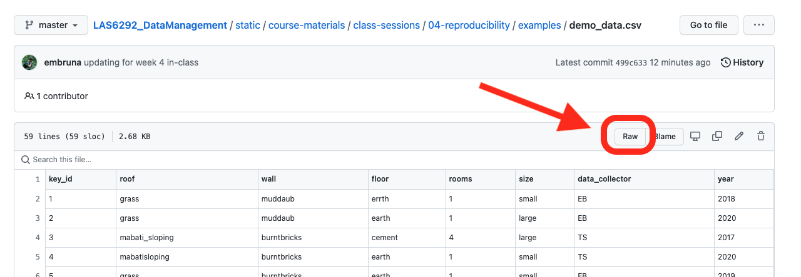

```{r setup, include=FALSE}
library(knitr)
library(rmdformats)

## Global options
options(max.print="75")
opts_chunk$set(echo=FALSE,
	             cache=TRUE,
               prompt=FALSE,
               tidy=TRUE,
               comment=NA,
               message=FALSE,
               warning=FALSE)
opts_knit$set(width=75)
```


# Intro to Reproducibile Data Cleanup in R

## 1. Set up an RStudio Project and download the relevant packages

1. File -> New Project
1. Name the Project as follows: `las_demo`
1. Create the following three folders: 

   `data_raw`  
   `data_clean`  
   `code`  

    You can create these in the folder using your operating systems "create folder" option **_or_** you can create within R studio using the `files` tab

1. Install libraries, load libraries, and run commands 

```{r echo = T, results = 'hide', eval=FALSE}
# Use the tab to install package `dadjokeapi`. 
# You could also do the following:
install.packages("dadjokesapi")
install.packages("tidyverse")
# load the library
library(dadjokeapi)
# run a command
groan()
```

## 2. Download the data we will be using in class

1. Open the messy data file `demo_data.csv` by following [this link](https://raw.githubusercontent.com/BrunaLab/LAS6292_DataManagement/master/instructor-materials/class-sessions/04-reproducibility/examples/demo_data.csv)
1. the data will open as a tab in your web browser in `.csv` format; save them to the `data_raw` folder by going to 'File' on the menu bar of your web browser and selecting 'Save page as' from the drop-down menu.
1. save the file to the `data_raw` folder. 

<!-- {width=50%} -->

## 3. Data Cleaning: Overview

1. _Characteristics of clean data set include:_

   * Free of duplicate rows/values
   * Error-free (correct misspellings, eliminate special characters)
   * correct data type for analysis
   * outliers identified and dealt in the correct way
   * “tidy" data structure

2. _Take your data from `messy` to `clean` in 5 steps_  
    
   *  Familiarize yourself with the data set
   *  Check for structural errors
   *  Check for data irregularities
   *  Decide how to deal with missing values

## 4. Data Cleaning: Practice

### 1. Review the Data Set

1. Review the `.csv` file 
2. What things do you see that need to be corrected? 
3. Make a list of the what you think needs to be corrected and the steps necessary to identify and implement each correction. Some of the things to look out for include: 
    
    * Numeric values stored as character data types
    * Factors stred as characters
    * Duplicate rows
    * Spelling mistakes
    * inconsistent formatting (eg., codes, capitalizations)
    * White spaces
    * Missing data
    * Zeros instead of null values
    * Special characters (e.g. commas in numeric values instead of decimals)
    * column headings with spaces between words or that start with numerals 
    
4. It is often useful to make an outline of the different steps. Note that there might be differetn ways to do the same thing, so an outline will help figure out which is best. For instance: 

  >**_Option 1_**   
    1. Import table 1   
    2. Correct column headings in Table 1  
    3. Import table 2  
    4. Correct column headings in Table 2  
    5. Bind Table 1 and Table 2 Together  

  >**_is less efficient than_** 

  >**_Option 2_**  
    1. Import table 1  
    2. Import table 2   
    3. Bind Table 1 and Table 2 Together   
    4. Correct the column headings in the Table    

      
### 2. Import

1. Create a new `.r` file and save it as `cleanup_code` in your `code` folder
2. Annotate your code and key info: session info(), name and what for, etc. Add the "Steps" to the .R as Sections with shift-cmd-r (Mac) or shift-alt-r (PC).
3. Load `tidyverse` library and import the data


I always insert some information about the script and what it is for at the top of any .r file
```{r}

## script name:
## Author: Emilio Bruna (embruna@ufl.edu)
## Date Created: 2021-02-02
## Date Updated: 2022-01-25
## script description: Some examples of how to use the Tidyverse and BaseR 
## for data clean-up
```

```{r echo = T, results = 'hide', eval=FALSE}

library(tidyverse)
# load the file with `read_csv`. 
# BE SURE TO POINT TO THE RIGHT LOCATION IN YOUR R STUDIO PROJECT 
# ./ is the "root folder" where your .Rproj file is located
demo <- 
  read_csv("./instructor-materials/class-sessions/04-reproducibility/examples/demo_data.csv")

```

>When we loaded the data into R, it got stored as an object of class tibble,  which is a special kind of data frame. A data frame is the representation of data in the format of a table where the columns are vectors that all have the same length. Because columns are vectors, each column must contain a single type of data (e.g., characters, integers, factors).

4. A quick step back: load file into R and go over 2 ways to look it over: (a) in the viewer and (b) using commands `str` and `glimpse`. 

```{r echo = T, results = 'hide', eval=FALSE}

# This is a good time to go over the difference 
# between `base R` and `Tidyverse`
glimpse(demo)
str(demo)

# You can also get an idea of the size of the df / tibble

# `dim(demo)` returns a vector with the number of rows in the 1st element,
# and the number of columns as the 2nd element
# (the dimensions of the object)
dim(demo)
# nrow(demo) - returns the number of rows
nrow(demo)
# ncol(demo) - returns the number of columns
ncol(demo)
# look at the top few rows with 'head'
head(demo)
# You'll note the `tidyverse` version is usually easier to read

# open it an look at it with 'view' or 2x click the name in 
view(demo)

# get a list of the column names 
names(demo)
# or 
colnames(demo)  #for dataframes

# how do you look at individual columns? 
demo$year
# what is the range of values in a column `year`? 
range(demo$year)

```

### 3. Make changes
1. read and edit column names
1. no. of levels in a factor
1. correct roof types
1. ordered factors
1. convert roof names to codes
1. replace NAs
1. add a column
1. export csv
1. reimport csv and verify


```{r echo = T, results = 'hide', eval=FALSE}

# 1. read and edit column names
names(demo)
# dataframe <- rename(dataframe, "new column name" = "old column name")
# `survey_year`: shorten to `year`
demo <- rename(demo, "year"="survey_year")
names(demo)
# `type_of_house_roof`: shorten to `roof`
demo <- rename(demo, "roof"="type_of_house_roof")
# `2020_kids`: change to `kids_2020`
demo <- rename(demo, "kids_2020"="2020_kids")
names(demo)

# 2. how many levels in factor?
levels(demo$roof)
unique(demo$roof)
demo$roof<-as.factor(demo$roof)
levels(demo$roof)

# 3. Correct the roof types

# by correcting spelling with gsub 
demo$roof<-gsub("mabati_sloping", "mabatisloping", demo$roof)

# The tidyverse way 
demo$roof<-recode(demo$roof, Grass = "grass")

# note that this would simpler if you just 
# converted everything to lower case!
demo$roof<-tolower(demo$roof)

# 4. correct the data type of roof
demo$floor<-as.factor(demo$floor)

# 5. make `size` an ordered factor
# Change column data types to ordered factor
demo$size
as.factor(demo$size)
ordered(demo$size, levels = c("small", "large"))
# same thing...need to assign the change.
demo$size <- ordered(demo$size, levels = c("small", "large"))
levels(demo$size)

# 6. convert to roof to codes: `GR`, `MB`  
demo$roof

demo<- demo %>% mutate(roof = case_when(roof == "grass" ~ 'g',
                                 roof == "mabatisloping" ~ 'm',
                                 TRUE ~ roof))

# throws an error becauise there is an NA. two ways to deal with this: 
  
# a. replace the NAs:
  demo <- demo %>% replace_na(list(roof = "missing"))

# b. change the cvvalue of what to repalce the NAs with 
  demo<- demo %>% mutate(roof = case_when(roof == "grass" ~ 'g',
                                 roof == "mabatisloping" ~ 'm',
                                 TRUE ~ "missing"))

# 7. Add a column
  demo$country<- "kenya"
  # or 
  demo<- demo %>% mutate(country = "kenya")

```


### 4. Export & verify clean data

1. save as a `.csv` file in the `data_clean` folder

```{r echo = T, results = 'hide', eval=FALSE}
  write_csv(demo, "./data_clean/demo_clean.csv")
```

2. Opening the clean `.csv` with excel to verify the changes are there

```{r echo = T, results = 'hide', eval=FALSE}
demo_clean<-read_csv("./data_clean/demo_clean.csv")
```

Remember! 

`read_csv`: `trim_ws` is `default=TRUE`
`read.csv`: `trim_ws` is `default=FALSE`

### 5. Reproduce your results

1. Sweep the environment
2. restart R
3. rerun your code to make sure it works
      
## 5. KEY MESSAGES

1. Keep raw data raw. Always.
2. Remember: the # symbol (hash tag) allows you to make comments in the script. Be sure to Annotate. Lots. 
