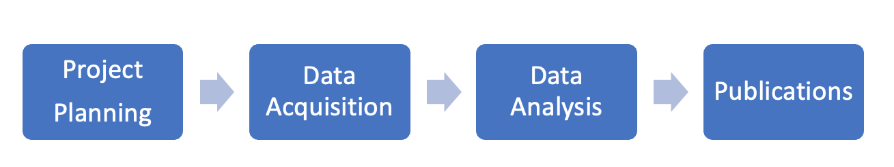
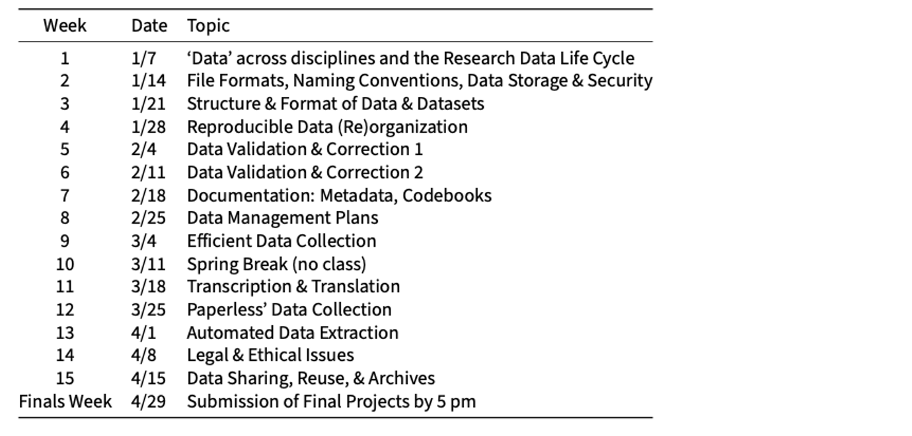
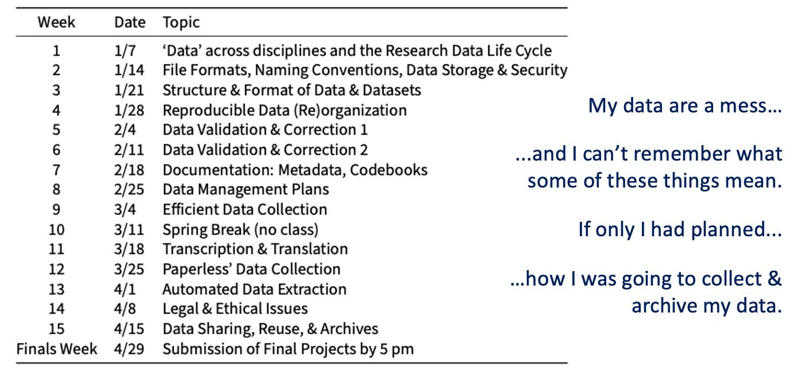
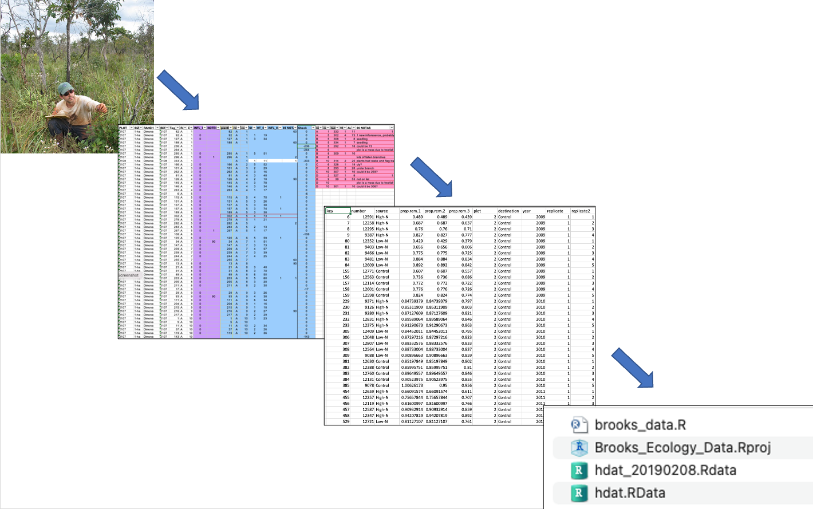

```{r setup, include=FALSE}
knitr::opts_chunk$set(echo = FALSE)
```

## “Typical”  <font size="5">(old-school)</font>  Research Flow

<center>

</center>

## Today: “The Research Data Life-Cycle”

<center>

</center>

## Course Outline

<center>

</center>

## Course Outline

<center>

</center>


##  {.columns-2}

<center>

</center>

<h2  style="color:#000066;">Before Class</h2>
Read, Watch, Reflect  

<h2  style="color:#000066;">During Class</h2> 
Exercises to Reinforce  
Discuss Readings  
Work on Individual Projects  

   
   
   


##  {.columns-2}

<center>

</center>

<h2  style="color:#000066;">Before Class</h2>
Read, Watch, Reflect  

<h2  style="color:#000066;">During Class</h2> 
Exercises to Reinforce  
Discuss Readings  
Work on Individual Projects  

   
   
   
<font size="3">This Class is...Flipped</font>   
<font size="3">_(see what I did there?)_</font>


## This class is an excuse to do what you have to do anyway.


```{r echo=FALSE, out.width='100%'}

```


## Let’s find out a little more…

<h2  style="color:#000066;">In-Class Exercise Wk. 1</h2> 


