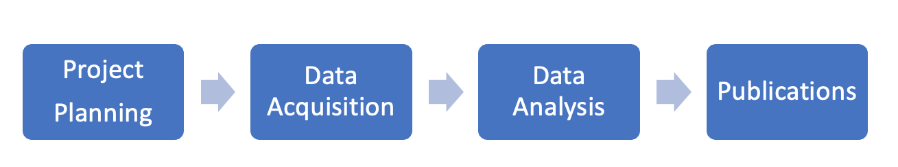
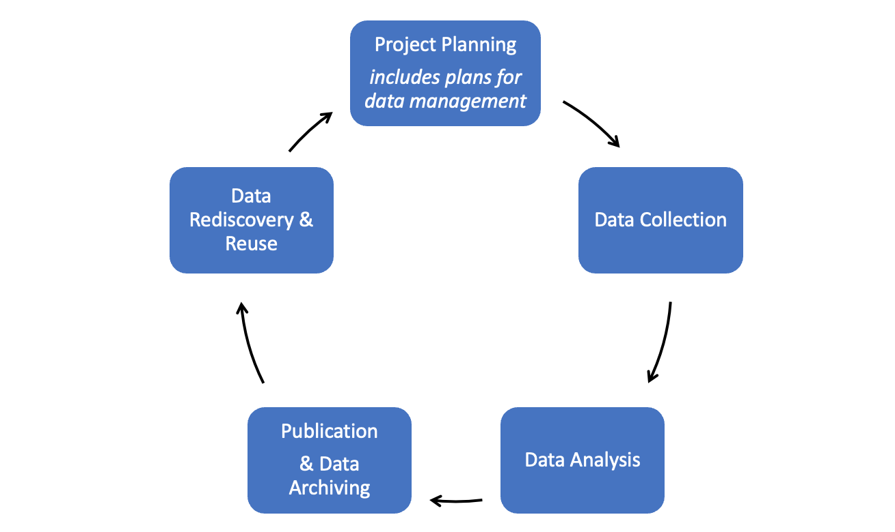
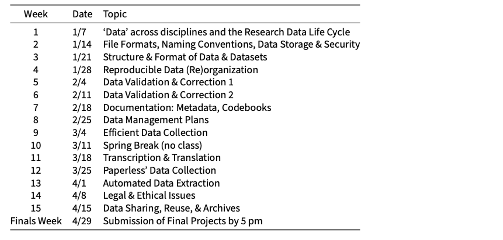
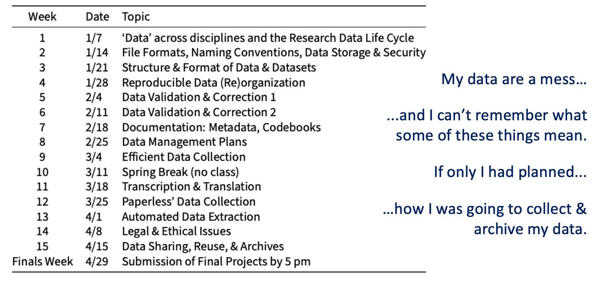

```{r setup, include=FALSE}
knitr::opts_chunk$set(echo = FALSE)
```

## Welcome!

<font size="7" style="font-weight: bold;" color="#000066">INTRODUCTIONS</font>    

<font size="4">  

1. Name  
2. In what city were you born?  
3. What you consider your “hometown”?  
4. Program and Degree?  
5. Hobbies or what you do to relax or have fun  
<!-- 5. Thesis topic…in emojis --> 
<!-- (works best for online) -->

</font>    

<font size="7" style="font-weight: bold;" color="#000066">DISCUSS</font>  
<font size="4">  
1. Motivation for taking the class  
2. Concerns about this class (in particular) and this semester (in general)?   
3. Big Question on the next slide  
</font>   

## 
$$\\[20pt]$$   
<center>
<font size="15" style="font-weight: bold;" color="#050505">What are</font> 
</center>
<center>
<font size="15" style="font-weight: bold;" color="#900C3F">'DATA'?</font> 
</center>


## “Typical”  <font size="5">(old-school)</font>  Research Flow

<!-- this adds space between top of slide and figure -->
$$\\[17pt]$$   

<center>

</center>

## Today: “The Research Data Life-Cycle”

<center>

</center>

## Course Outline

<center>

</center>

## Course Outline

<center>

</center>


##  {.columns-2}

<center>

</center>

<h2  style="color:#000066;">Before Class</h2>
Read, Watch, Reflect  

<h2  style="color:#000066;">During Class</h2> 
Exercises to Reinforce  
Discuss Readings  
Work on Individual Projects  

   
   
   


##  {.columns-2}

<center>

</center>

<h2  style="color:#000066;">Before Class</h2>
Read, Watch, Reflect  

<h2  style="color:#000066;">During Class</h2> 
Exercises to Reinforce  
Discuss Readings  
Work on Individual Projects  

   
   
$$\\[14pt]$$

<font size="3">This Class is...Flipped</font>   
<font size="3">_(see what I did there?)_</font>

## <font size="6">This class is an excuse to do what you have to do anyway.</font>


<center>

</center>


## Let’s find out a little more…

$$\\[20pt]$$   
<!-- can also indent using e.g., 40px instead of % -->
<!-- <p style="margin-left: 20%">  text </p> -->
<center>
<font size="12" color="#000066">In-Class Exercise Wk. 1</font>
</center>


